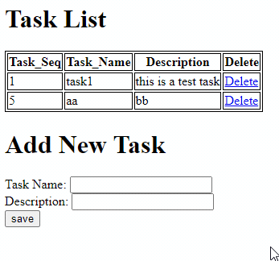
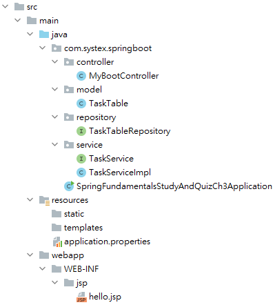

# Spring Fundamentals Self-Study and Quiz

## Chapter 3

本章節將練習使用 Spring Boot完成Ch2的所有功能：

- 讀出Part3_Ch4所設定的table資料，且具刪除功能。
- 簡單的新增功能，並更新上方清單。

本題不再提供專案，使用https://start.spring.io/ 自行建立spring boot project。

專案結構可參考：

